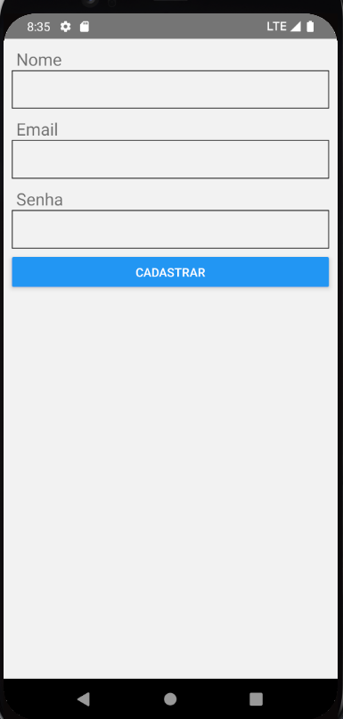

</br>

<p>PROJETO EM REACT-NATIVE</p>
<hr>
</br>
    <h3 aling="center"> Projeto realizado seguindo aulas!</h3>
    <p> Projeto que realiza cadastro e login salvando as informações no banco de dados FireBase </p>
    </br>
    <P> Este projeto contém </p>
    <ul>
        <li> Tela de Cadastro </li>
        <li> Tela de Login </li>
        <li> Informações salvas no Banco de Dados (FireBase) </li>
    </ul>
    
</br>
    
    
</br>
</br>

### 🎲 Rodando o Front 

```bash

    # Clone este repositório  
    $ git clone <https://github.com/KayoSilva19/app-Cadastro-Login-FireBase>

    # Acesse a pasta do projeto no terminal/cmd
    $ cd appFirebase

    $ npm install

    # Com o React-Native instalado execute o projeto
    $ npx react-native run-android

```
